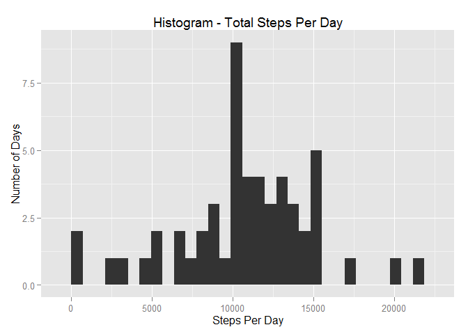
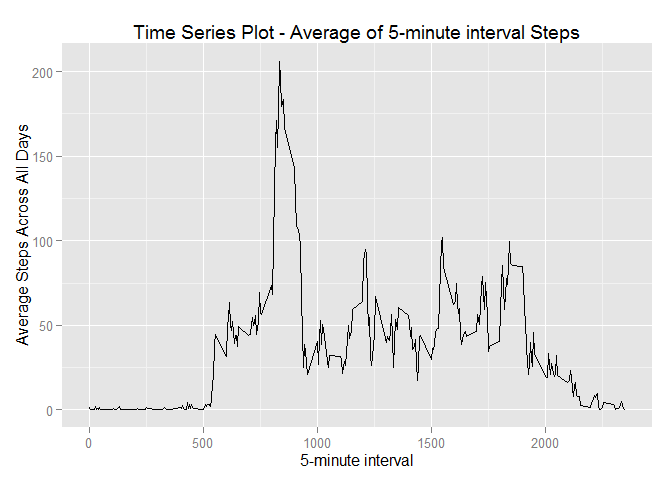
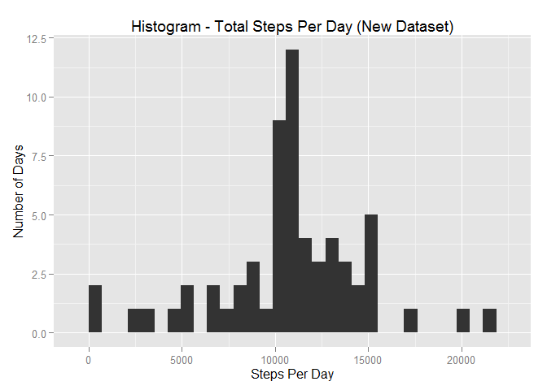
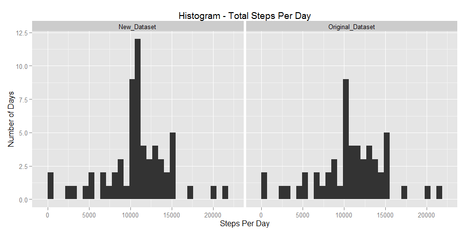
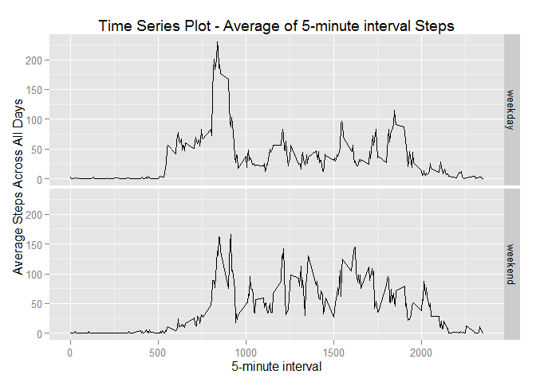
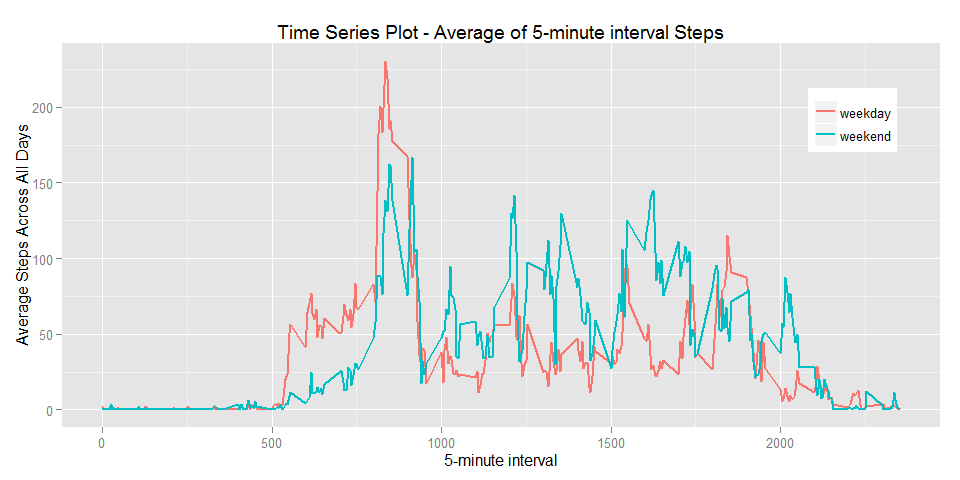

# Reproducible Research: Programming Assignment 1
Alex Looi  
Wednesday, April 15, 2015  

================================================================================

## Requirements
Programming Assignment 1 requires us write a report that answers the questions
detailed below:

1. Loading and preprocessing the data
2. What is mean total number of steps taken per day?
3. What is the average daily activity pattern?
4. Imputing missing values
5. Are there differences in activity patterns between weekdays and weekends?

================================================================================

## Sequence of Events
This R Markdown file will follow the following sequence of events:

1. Introduction, which briefly describe what this analysis is all about.
2. Initialization, which contains code that load the required libraries
and set default global options.
3. Loading and preprocessing the data, which contains code to get the raw data
from a source, eg an URL. and transform the raw data to analytic data.
4. Analysis 1, which contains code that analyze what is mean total number of
steps taken per day.
5. Analysis 2, which contains code that analyze What is the average daily
activity pattern.
6. Reprocessing the data, which contains code to impute the missing values
in the data set and create a new data set.
7. Analysis 3, which contains code that find out if there are differences in
activity patterns between weekdays and weekends using the reprocessed data set.

The output of each events, if any, will be displayed together with the codes
of that particular event.

This R markdown document alone is sufficient to reproduce the analysis.
No other documents, codes, or data sets are required.


================================================================================

## 1. Introduction
The objective of this analysis is to find out:

1. What is mean total number of steps taken per day?
2. What is the average daily activity pattern?
3. What is the impact of imputing missing data on the estimates of the total
daily number of steps?
4. Are there differences in activity patterns between weekdays and weekends?

This analysis makes use of data from a personal activity monitoring device which
collects data at 5 minute intervals through out the day. The data consists of
two months of data from an anonymous individual collected during the months of
October and November, 2012 and include the number of steps taken in 5 minute
intervals each day.

The raw data set contains the following variable:

- steps: Number of steps taking in a 5-minute interval (missing values are
coded as NA)
- date: The date on which the measurement was taken in YYYY-MM-DD format
- interval: Identifier for the 5-minute interval in which measurement was taken


================================================================================

## 2. Initialization

This part of the code loads the required libraries to run the code.
Please ensure that the required librarys are installed.
The code will also set the default global options.

#### --- Load Library ---

```r
library(knitr)
```

```
## Warning: package 'knitr' was built under R version 3.1.3
```

```r
library(dplyr)
```

```
## Warning: package 'dplyr' was built under R version 3.1.3
```

```
## 
## Attaching package: 'dplyr'
## 
## The following object is masked from 'package:stats':
## 
##     filter
## 
## The following objects are masked from 'package:base':
## 
##     intersect, setdiff, setequal, union
```

```r
library(Rcpp)
```

```
## Warning: package 'Rcpp' was built under R version 3.1.3
```

```r
library(ggplot2)
```

```
## Warning: package 'ggplot2' was built under R version 3.1.3
```

#### --- Set Global Options ---

```r
opts_chunk$set(echo = TRUE) # include R codes in output file
options(scipen = 100) # numbers are displayed in full.
```


================================================================================

## 3. Loading and preprocessing the data

This part of the code download the raw data set from the URL
https://github.com/looialex/RepData_PeerAssessment1/blob/master/activity.zip?raw=true",
which essentially is the forked repo for this assignment. The code then unzip and
read in the csv file, and sort it according to the data variable follow by the
interval variable (just in case it is not already sorted).

#### --- Download and Unzip Raw Data Set ---

```r
if (!file.exists("data")) dir.create("data") # creates a "data" directory
setInternet2(use = TRUE) # to enable IE for downloading file from https.
url <- "https://github.com/looialex/RepData_PeerAssessment1/blob/master/activity.zip?raw=true"

# Check if zip file exist in the working directory. If it exists, just unzip it.
# If it doesn't exist, download it and unzip.
if (file.exists("./data/activity.zip")){
        unzip("./data/activity.zip", exdir = "./data")
} else {
        download.file(url, destfile = "./data/activity.zip", mode = "wb")
        datedownloaded <- date()      
        unzip("./data/activity.zip", exdir = "./data")
}
```

#### --- Reading in data set ---

```r
data <- read.csv("./data/activity.csv")
data <- as.tbl(data) # convert to tbl df to use dplyr functions.
data <- arrange(data, date, interval) # Sort data set by date then by interval
```


================================================================================

## 4. Analysis 1

The part of the code analyze what is mean total number of steps taken per day.
Specifically, the code performs the following:

1. Calculate the total number of steps taken per day
2. Make a histogram of the total number of steps taken each day
3. Calculate and report the mean and median of the total number of steps taken per day

Note that missing values in the data set are ignored

#### --- Total number of steps taken per day ---

```r
data_noNA <- na.omit(data) # remove observations with NA.
data_bydate <- group_by(data_noNA, date)     # Group data by date
sum_bydate <- summarize(data_bydate, totalsteps = sum(steps)) # add up the steps
```


#### --- Histogram of the total number of steps taken each day ---
*Note that the binwidth of the Histogram is the system default binwidth.*

```r
title <- "Histogram - Total Steps Per Day" # assign chart title
xlabel <- "Steps Per Day"       # assign X label
ylabel <- "Number of Days"      # assign y label
g <- ggplot(sum_bydate, aes(x = totalsteps))
p <- g + geom_histogram() + labs(list(title = title, x = xlabel, y = ylabel))
print(p)
```

 


#### --- Mean and Median of the total number of steps taken per day ---

```r
meansteps <- mean(sum_bydate$totalsteps)        # calculate mean
mediansteps <- median(sum_bydate$totalsteps)    # calculate median
```

**The mean of the total number of steps taken per day is 10766.1886792.**  
**The median of the total number of steps taken per day 10765.**


================================================================================

## 5. Analysis 2

This part of the code analyze What is the average daily activity pattern.
Specifically, the code performs the following:

1. Make a time series plot of the 5-minute interval (x-axis) and
the average number of steps taken, averaged across all days (y-axis)

2. Find out which 5-minute interval, on average across all the days in the dataset,
contains the maximum number of steps.

Note that missing values in the data set are ignored

#### --- Time series plot ---

```r
data_byint <- group_by(data_noNA, interval)  # group data by interval
mean_byint <- summarize(data_byint, averagesteps = mean(steps))

# Plot Time Series
title <- "Time Series Plot - Average of 5-minute interval Steps" # assign chart title
xlabel <- "5-minute interval"       # assign X label
ylabel <- "Average Steps Across All Days"      # assign y label
g <- ggplot(mean_byint, aes(x = interval, y = averagesteps))
p <- g + geom_line() + labs(list(title = title, x = xlabel, y = ylabel))
print(p)
```

 

#### --- Maximum average number of steps ---

```r
maxavg <- max(mean_byint$averagesteps) # find out the max of variable averagesteps
int_maxavg <- filter(mean_byint, averagesteps == maxavg)
```

**The 5-minute interval, on average across all the days in the dataset,
which contains the maximum number of steps is at interval 835.
At this 5-minute interval, the average number of steps is 206.1698113.**


================================================================================

## 6. Reprocessing the data

This part of the code impute the missing values in the data set and create
a new data set. Specifically, the code performs the following:

1. Calculate and report the total number of missing values in the dataset.

2. Devise a strategy for filling in all of the missing values in the dataset.

3. Create a new dataset that is equal to the original dataset but with
the missing data filled in.

4. Make a histogram of the total number of steps taken each day, calculate and
report the mean and median total number of steps taken per day, and address the
following questions:

- Do these values differ from the estimates from the first part of the assignment?
(i.e. in Analysis 1)

- What is the impact of imputing missing data on the estimates of the total daily
number of steps?


#### --- Total number of missing values ---

```r
totalNA <- sum(is.na(data$steps)) # count the number of NA
```

**The total number of missing values in the dataset is 2304.**
<br>
<br>

#### --- Filling missing values and creating new data set---

The NAs will be filled with the average of the 5-minute interval across all days.


```r
# Calculate mean_byint again in case user wants to run this step only.
mean_byint <- summarize(data_byint, averagesteps = mean(steps))

newdata <- merge(data, mean_byint, "interval") # combine original data and mean_byint
naIndex <- which(is.na(newdata$steps)) # get the row number with steps = NA
newdata$steps[naIndex] <- newdata$averagesteps[naIndex] # assign NA with mean_byint
newdata <- select(newdata, -averagesteps) # delete variable "averagesteps"
```

**New dataset is created. NA values are filled with the mean for that
5-minute interval.**
<br>
<br>

#### --- Histogram, Mean and Median of new dataset ---

```r
newdata <- as.tbl(newdata) # convert to tbl df to use dplyr functions.
newdata_bydate <- group_by(newdata, date)     # Group data by date

# Calculate total steps by date
newsum_bydate <- summarize(newdata_bydate, totalsteps = sum(steps))
```


```r
# Plotting Histogram
# The binwidth of the Histogram is the system default binwidth.
title <- "Histogram - Total Steps Per Day (New Dataset)" # assign chart title
xlabel <- "Steps Per Day"       # assign X label
ylabel <- "Number of Days"      # assign y label
g <- ggplot(newsum_bydate, aes(x = totalsteps))
p <- g + geom_histogram() + labs(list(title = title, x = xlabel, y = ylabel))
print(p)
```

 


```r
newmeansteps <- mean(newsum_bydate$totalsteps)        # calculate new mean
newmediansteps <- median(newsum_bydate$totalsteps)    # calculate new median
```

**The mean of the total number of steps taken per day for the new dataset
is 10766.1886792.**  
**The median of the total number of steps taken per day for the new dataset
is 10766.1886792.**
<br>
<br>

Questions: Do these values differ from the estimates from the first part of the
assignment? (i.e. in Analysis 1)
<br>
<br>

Answer:  
Mean: There is no difference between the old mean (10766.1886792) and the
new mean (10766.1886792) after imputing the NA values.  
Median: There is a slight increase of the median, from old median
(10765) to new median (10766.1886792) after imputing the NA values.
<br>
<br>
It is interesting to note that the median and the mean are equal after imputing
the NA values.
<br>
<br>

Questions: What is the impact of imputing missing data on the estimates of the
total daily number of steps?
<br>
<br>

Answer:  
The Histogram of total number of steps taken each day for both dataset (with NA
ignored and with NA imputed) are reproduced below for easy comparison.


```r
# Plotting Histogram
# The binwidth of the Histogram is the system default binwidth.

# Combine both original sum_bydate and new sum_bydate together to use ggplot facet
combine_data <- rbind(mutate(sum_bydate, type = "Original_Dataset"),
                      mutate(newsum_bydate, type = "New_Dataset"))

# plot Histrogram of combined dataset
title <- "Histogram - Total Steps Per Day" # assign chart title
xlabel <- "Steps Per Day"       # assign X label
ylabel <- "Number of Days"      # assign y label
g <- ggplot(combine_data, aes(x = totalsteps))
p <- g + geom_histogram() + labs(list(title = title, x = xlabel, y = ylabel)) +
        facet_grid(.~type)
print(p)
```

 

From the Histogram, we can see that there is a new peak in the new histogram.


```r
# Find the max freq and bin center of that max frew for the new dataset
g <- ggplot(subset(combine_data, type == "New_Dataset"), aes(x = totalsteps))
p <- g + geom_histogram()
histdata <- ggplot_build(p)
maxdays <- max(histdata$data[[1]][,"count"]) # find the max freq

# get the bin center
bincenter <- histdata$data[[1]][which((histdata$data[[1]][,"count"]) == maxdays),"x"]
```

The new peak has a frequncy of 12 with the bin center at 10929.05,
which is the results of the method we choose to impute the NA values in the dataset.


================================================================================

## 7. Analysis 3

This part of the code check if there are differences in activity patterns
between weekdays and weekends using the reprocessed data set obtained in (6).
Specifically, the code performs the following:

1. Create a new factor variable in the dataset with two levels - "weekday"
and "weekend" indicating whether a given date is a weekday or weekend day.

2. Make a panel plot containing a time series plot of the 5-minute interval
(x-axis) and the average number of steps taken, averaged across all weekday days
or weekend days (y-axis).

Note that dataset with imputed values for NA are used.

#### --- Create new factor variable "weekday" / "weekend" ---

```r
newdata$date <- as.Date(newdata$date, "%Y-%m-%d") # convert text date to date format
wkday_wkend <- mutate(newdata, dayofweek = weekdays(date)) # add week day column

# Check day whether it is weekend or not
wkday_wkend <- mutate(wkday_wkend, isweekend = dayofweek %in% c("Saturday", "Sunday"))

# Replace True / False in isweekend column to weekend / weekday
wkday_wkend <- mutate(wkday_wkend, isweekend = ifelse(isweekend, "weekend", "weekday"))
wkday_wkend$isweekend <- as.factor(wkday_wkend$isweekend) # convert to factor
```


#### --- Time series plot ---

```r
# group data by whether is it a weekend, and by interval
wkday_wkend <- group_by(wkday_wkend, isweekend, interval)
mean_wkday_wkend <- summarize(wkday_wkend, averagesteps = mean(steps))

# Plot Time Series
title <- "Time Series Plot - Average of 5-minute interval Steps" # assign chart title
xlabel <- "5-minute interval"       # assign X label
ylabel <- "Average Steps Across All Days"      # assign y label
g <- ggplot(mean_wkday_wkend, aes(x = interval, y = averagesteps))
p <- g + geom_line() + labs(list(title = title, x = xlabel, y = ylabel)) + 
        facet_grid(isweekend~.)
print(p)
```

 

The above plot is required by the question (as shown in the README file example).
However, it is difficult to compare if there are differences in activity patterns
between weekdays and weekends. Therefore, another plot in a different format
is done below.


```r
# Plot Time Series - Another Format
title <- "Time Series Plot - Average of 5-minute interval Steps" # assign chart title
xlabel <- "5-minute interval"       # assign X label
ylabel <- "Average Steps Across All Days"      # assign y label
g <- ggplot(mean_wkday_wkend, aes(x = interval, y = averagesteps,
                                  colour = isweekend, group = isweekend))
p <- g + geom_line(size = 1) + labs(list(title = title, x = xlabel, y = ylabel)) +
        theme(legend.position = c(0.9, 0.8), legend.title=element_blank())
print(p)
```

 

The number of steps corresponds to activities level. The higher the number of steps,
the higher the activity level.  

Based on this graph, a few differences can be observed:

1. During weekdays, activities start earlier than during weekends. This is probably
due to the need to wake up early to work during weekdays.
2. During weekends, the activities in the middle of the day (from around 1000 minutes)
is higher as compared to during weekdays. This is likely due to the subject working
in an office environment, where walking is not alot. And during weekends, the
subject probably go out and have fun, therefore having a higher activity level.
3. During weekends, the activity level remains high till late at night
(beyond 2000 minutes) as compared to during weekdays. This may be due to subject
partying late in weekends, while for weekdays, subject probably go home and rest
after work.

===============================================================================

End of R Markdown file.

